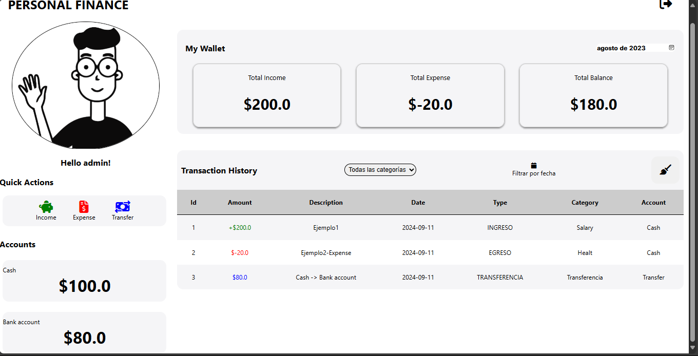

# MiChaucherita

Este proyecto es una aplicación web desarrollada en **Java Servlet** y **Hibernate** utilizando **Maven** como sistema de construcción. La aplicación se desplegará en un servidor compatible con Java EE, y utiliza una base de datos **MySQL** para el almacenamiento de datos.
## Tecnologías Utilizadas

- **Java EE**: Java Servlet API (javax.servlet-api)
- **Hibernate**: Para la capa de persistencia (ORM)
- **MySQL**: Base de datos utilizada
- **JSTL**: JavaServer Pages Standard Tag Library
- **Jersey**: Para servicios REST
- **JSP**: JavaServer Pages para la vista
- **HTML/CSS/JS**: Para la interfaz de usuario

## Dependencias

El archivo `pom.xml` contiene las siguientes dependencias importantes (no hace falta :

- **javax.servlet-api**: Proporciona la API de Java Servlet.
- **jstl**: Para el uso de JSTL en páginas JSP.
- **mysql-connector-java**: Driver JDBC para la conexión con MySQL.
- **javax.persistence-api**: API de JPA para la persistencia de datos.
- **hibernate-core**: Implementación de Hibernate para JPA.
- **jersey-container-servlet**: Jersey para manejar los servicios RESTful.
- **jersey-hk2**: Inyección de dependencias con Jersey.
- **jaxb-api** y **jaxb-runtime**: Para la manipulación de XML y JSON.
- **javax.json.bind-api**: Para binding de JSON.
- **jersey-media-json-jackson**: Soporte de Jackson para Jersey y la conversión de JSON.

## Requisitos
- **Java 11 o superior:** Asegúrate de tener instalada la versión 11 o superior de Java.
- **Apache Tomcat 9.x:** Para el despliegue del archivo WAR.

## Configuración de Base de Datos
La configuración de la base de datos para Hibernate está en el archivo persistence.xml, ubicado en la carpeta resources/META-INF/. 
Asegúrate de que la base de datos MySQL esté correctamente configurada con las credenciales y los parámetros adecuados.

## Pasos para ejecutar la base de datos

- Primero, asegurese de crear solo la base de datos  `create database michaucheritadb`, las tablas se crearan posteriormente.
- Luego, asegurarse que en el archivo persistence la etiqueta property esté con un valor
de `update` así como se muestra aconinuación: `<property name="hibernate.hbm2ddl.auto" value="update" />`.
- Posterior a eso ejecutar el archivo `testJPA` que se encuentra en `/src/main/java/modelo/jpa/testJPA` dado que en 
ese archivo se encuentra la ejecución de la base da datos.
- Finalmente, ejecutar con tomcat 9.x para que inicie la aplicación web.

Si no quieren seguir esos pasos pueden ejecutar el script de la base de datos:

```sql
SET SQL_MODE = "NO_AUTO_VALUE_ON_ZERO";
START TRANSACTION;
SET time_zone = "+00:00";

-- --------------------------------------------------------

-- CREAR BASE DE datos
CREATE DATABASE IF NOT EXISTS michaucheritadb;

USE michaucheritadb;

--
-- Estructura de tabla para la tabla `categoria`
--

CREATE TABLE `categoria` (
  `idCategoria` int(11) NOT NULL,
  `tipocategoria` int(11) DEFAULT NULL,
  `nombre` varchar(255) DEFAULT NULL,
  `usuario` int(11) DEFAULT NULL
) ENGINE=InnoDB DEFAULT CHARSET=utf8mb4 COLLATE=utf8mb4_general_ci;

--
-- Volcado de datos para la tabla `categoria`
--

INSERT INTO `categoria` (`idCategoria`, `tipocategoria`, `nombre`, `usuario`) VALUES
(1, 0, 'Salary', 1),
(2, 0, 'Monthly money', 1),
(3, 0, 'Plus', 1),
(4, 1, 'Food', 1),
(5, 1, 'Healt', 1),
(6, 1, 'Transport', 1),
(7, 1, 'Home', 1),
(8, 2, 'Transferencia', 1);

-- --------------------------------------------------------

--
-- Estructura de tabla para la tabla `cuenta`
--

CREATE TABLE `cuenta` (
  `idCuenta` int(11) NOT NULL,
  `descripcion` varchar(255) DEFAULT NULL,
  `nombre` varchar(255) DEFAULT NULL,
  `saldo` double DEFAULT NULL,
  `usuario_id` int(11) DEFAULT NULL
) ENGINE=InnoDB DEFAULT CHARSET=utf8mb4 COLLATE=utf8mb4_general_ci;

--
-- Volcado de datos para la tabla `cuenta`
--

INSERT INTO `cuenta` (`idCuenta`, `descripcion`, `nombre`, `saldo`, `usuario_id`) VALUES
(1, 'Cash', 'Cash', 0, 1),
(2, 'Money from my bank', 'Bank account', 0, 1),
(3, 'Oculto', 'Transfer', 0, 1);

-- --------------------------------------------------------

--
-- Estructura de tabla para la tabla `movimiento`
--

CREATE TABLE `movimiento` (
  `idMovimiento` int(11) NOT NULL,
  `descripcion` varchar(255) DEFAULT NULL,
  `fecha` varchar(255) DEFAULT NULL,
  `tipo` int(11) DEFAULT NULL,
  `valor` double DEFAULT NULL,
  `categoria` int(11) DEFAULT NULL,
  `cuenta` int(11) DEFAULT NULL
) ENGINE=InnoDB DEFAULT CHARSET=utf8mb4 COLLATE=utf8mb4_general_ci;

-- --------------------------------------------------------

--
-- Estructura de tabla para la tabla `usuario`
--

CREATE TABLE `usuario` (
  `idUsuario` int(11) NOT NULL,
  `password` varchar(255) DEFAULT NULL,
  `username` varchar(255) DEFAULT NULL
) ENGINE=InnoDB DEFAULT CHARSET=utf8mb4 COLLATE=utf8mb4_general_ci;

--
-- Volcado de datos para la tabla `usuario`
--

INSERT INTO `usuario` (`idUsuario`, `password`, `username`) VALUES
(1, 'Admin123', 'Admin');

--
-- Índices para tablas volcadas
--

--
-- Indices de la tabla `categoria`
--
ALTER TABLE `categoria`
  ADD PRIMARY KEY (`idCategoria`),
  ADD KEY `FK7k7r3sr2jrt12efkqljmsrs49` (`usuario`);

--
-- Indices de la tabla `cuenta`
--
ALTER TABLE `cuenta`
  ADD PRIMARY KEY (`idCuenta`),
  ADD KEY `FK35pvw5iyhbw9mmjmfmrn0itrx` (`usuario_id`);

--
-- Indices de la tabla `movimiento`
--
ALTER TABLE `movimiento`
  ADD PRIMARY KEY (`idMovimiento`),
  ADD KEY `FKc7uxpggnc6e7pg9mnpto2dx68` (`categoria`),
  ADD KEY `FKtbw7hxexcyln7wv9a1ptsn7vu` (`cuenta`);

--
-- Indices de la tabla `usuario`
--
ALTER TABLE `usuario`
  ADD PRIMARY KEY (`idUsuario`);

--
-- AUTO_INCREMENT de las tablas volcadas
--

--
-- AUTO_INCREMENT de la tabla `categoria`
--
ALTER TABLE `categoria`
  MODIFY `idCategoria` int(11) NOT NULL AUTO_INCREMENT, AUTO_INCREMENT=9;

--
-- AUTO_INCREMENT de la tabla `cuenta`
--
ALTER TABLE `cuenta`
  MODIFY `idCuenta` int(11) NOT NULL AUTO_INCREMENT, AUTO_INCREMENT=5;

--
-- AUTO_INCREMENT de la tabla `movimiento`
--
ALTER TABLE `movimiento`
  MODIFY `idMovimiento` int(11) NOT NULL AUTO_INCREMENT;

--
-- AUTO_INCREMENT de la tabla `usuario`
--
ALTER TABLE `usuario`
  MODIFY `idUsuario` int(11) NOT NULL AUTO_INCREMENT, AUTO_INCREMENT=2;

--
-- Restricciones para tablas volcadas
--

--
-- Filtros para la tabla `categoria`
--
ALTER TABLE `categoria`
  ADD CONSTRAINT `FK7k7r3sr2jrt12efkqljmsrs49` FOREIGN KEY (`usuario`) REFERENCES `usuario` (`idUsuario`);

--
-- Filtros para la tabla `cuenta`
--
ALTER TABLE `cuenta`
  ADD CONSTRAINT `FK35pvw5iyhbw9mmjmfmrn0itrx` FOREIGN KEY (`usuario_id`) REFERENCES `usuario` (`idUsuario`);

--
-- Filtros para la tabla `movimiento`
--
ALTER TABLE `movimiento`
  ADD CONSTRAINT `FKc7uxpggnc6e7pg9mnpto2dx68` FOREIGN KEY (`categoria`) REFERENCES `categoria` (`idCategoria`),
  ADD CONSTRAINT `FKtbw7hxexcyln7wv9a1ptsn7vu` FOREIGN KEY (`cuenta`) REFERENCES `cuenta` (`idCuenta`);
COMMIT;

/*!40101 SET CHARACTER_SET_CLIENT=@OLD_CHARACTER_SET_CLIENT */;
/*!40101 SET CHARACTER_SET_RESULTS=@OLD_CHARACTER_SET_RESULTS */;
/*!40101 SET COLLATION_CONNECTION=@OLD_COLLATION_CONNECTION */;


```
## Contribuir
Si deseas contribuir a este proyecto, por favor realiza un fork del repositorio, crea una rama con tus cambios, y envía un pull request.

## Capturas de pantalla de la aplicación
La aplicación se desplega en el navegador e ingresamos con las credenciales, que para el ejemplo es
- Username: `Admin`
- Password: `Admin123`


Se nos presenta la interfaz del dashboard con todas las funcionalidades de la mismas.


Entre las funciones encontramos `Income` donde se nos presenta un pop up


Al dar en save, el dashboard se actualiza:


Otra funcionalidad es `Expense` donde se nos presenta un pop up


Al dar en save, el dashboard se actualiza:


Otra funcionalidad es `Transfer` donde se nos presenta un pop up


Al dar en save, el dashboard se actualiza:


