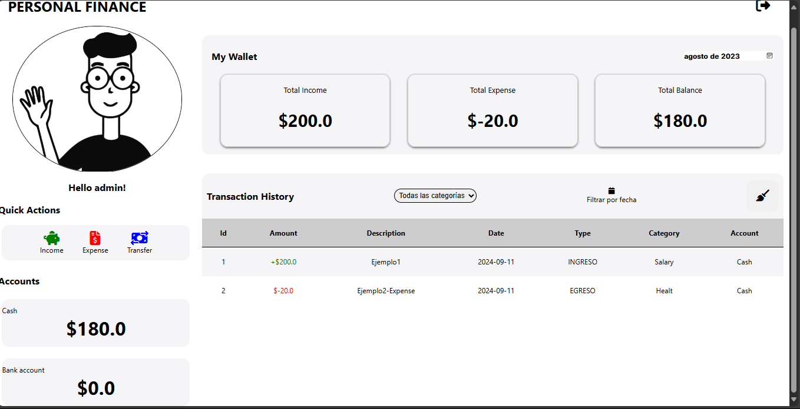

# MiChaucherita

Este proyecto es una aplicación web desarrollada en **Java Servlet** y **Hibernate** utilizando **Maven** como sistema de construcción. La aplicación se desplegará en un servidor compatible con Java EE, y utiliza una base de datos **MySQL** para el almacenamiento de datos.
## Tecnologías Utilizadas

- **Java EE**: Java Servlet API (javax.servlet-api)
- **Hibernate**: Para la capa de persistencia (ORM)
- **MySQL**: Base de datos utilizada
- **JSTL**: JavaServer Pages Standard Tag Library
- **Jersey**: Para servicios REST
- **JAXB**: Para manipulación de XML y JSON
- **JSP**: JavaServer Pages para la vista
- **HTML/CSS/JS**: Para la interfaz de usuario

## Dependencias

El archivo `pom.xml` contiene las siguientes dependencias importantes (no hace falta :

- **javax.servlet-api**: Proporciona la API de Java Servlet.
- **jstl**: Para el uso de JSTL en páginas JSP.
- **mysql-connector-java**: Driver JDBC para la conexión con MySQL.
- **javax.persistence-api**: API de JPA para la persistencia de datos.
- **hibernate-core**: Implementación de Hibernate para JPA.
- **jersey-container-servlet**: Jersey para manejar los servicios RESTful.
- **jersey-hk2**: Inyección de dependencias con Jersey.
- **jaxb-api** y **jaxb-runtime**: Para la manipulación de XML y JSON.
- **javax.json.bind-api**: Para binding de JSON.
- **jersey-media-json-jackson**: Soporte de Jackson para Jersey y la conversión de JSON.

## Requisitos
- **Java 11 o superior:** Asegúrate de tener instalada la versión 11 o superior de Java.
- **Apache Tomcat 9.x:** Para el despliegue del archivo WAR.

## Configuración de Base de Datos
La configuración de la base de datos para Hibernate está en el archivo persistence.xml, ubicado en la carpeta resources/META-INF/. 
Asegúrate de que la base de datos MySQL esté correctamente configurada con las credenciales y los parámetros adecuados.

## Pasos para ejecutar
- Primero ejecutar el archivo `testJPA` que se encuentra en `/src/main/java/modelo/jpa/testJPA` dado que en 
ese archivo se encuentra la ejecución de la base da datos
- Luego ejecutar con tomcat 9.x para que inicie la aplicación web
## Contribuir
Si deseas contribuir a este proyecto, por favor realiza un fork del repositorio, crea una rama con tus cambios, y envía un pull request.

## Capturas de pantalla de la aplicación
La aplicación se desplega en el navegador e ingresamos con las credenciales, que para el ejemplo es
- Username: `Admin`
- Password: `Admin123`

Se nos presenta la interfaz del dashboard con todas las funcionalidades de la mismas.

Entre las funciones encontramos `Income` donde se nos presenta un pop up

Al dar en save, el dashboard se actualiza:

Otra funcionalidad es `Expense` donde se nos presenta un pop up

Al dar en save, el dashboard se actualiza:

Otra funcionalidad es `Transfer` donde se nos presenta un pop up

Al dar en save, el dashboard se actualiza:

